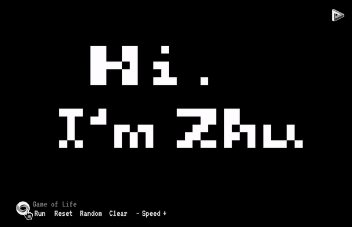

# Game Of Life

An interactive simulator of the classic cellular automaton Game of Life. Built with TypeScript and React.
####  

## Demo

You can play with the simulator at the home page of [my personal website](https://zhuyanwei.com/).

## Installation and Usage

In the project directory, you can run:

#### `npm install`

Installs all dependency required for the project.
#### `npm start`

Runs the app in the development mode.\
Open [http://localhost:3000](http://localhost:3000) to view it in the browser.

